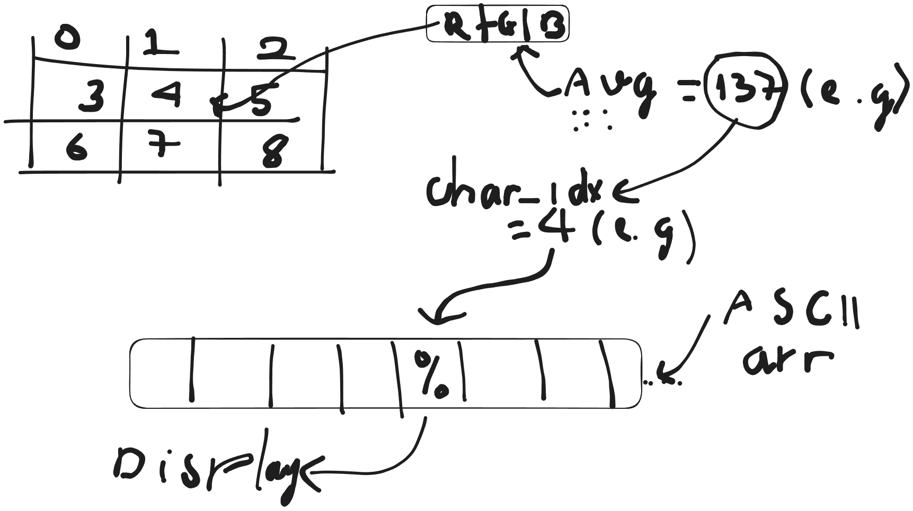

# gifter

**gifter** is a CLI tool written in Go for displaying **GIF**s as ASCII art directly in your **ter**minal.

---

## Features

- Display animated GIFs as ASCII art in your terminal  
- Simple CLI interface for ease of use  
- Lightweight and easy to run from source

---

## Usage

### Run from source:

```bash
make run file_path.gif # grayscale
make run-c file_path.gif # color
```

### Or run after building:

```bash
./gifter <file_path.gif>
./gifter --help
```

Replace `<file_path.gif>` with the path to your GIF file.

---

## Future Features

- Support for more ASCII art styles (e.g., shaded, bordered, blocky)
- Load images directly from the internet
- Support for additional image formats (JPEG, PNG, WebP, etc.)
- Color mode for more vibrant and expressive ASCII output

---



